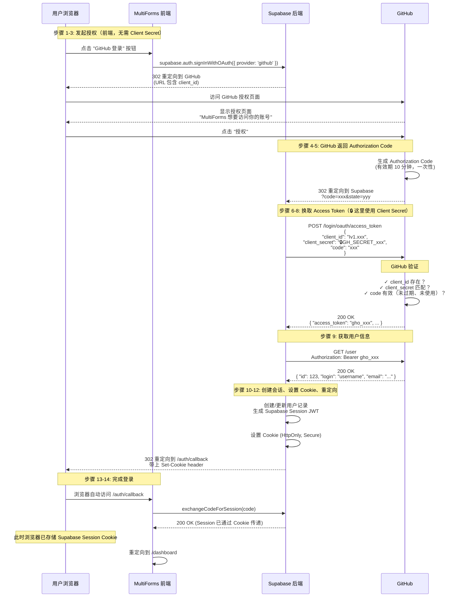

# GitHub OAuth 登录完整流程图

## 流程图



## 关键点总结

| 步骤 | Client Secret | 说明 |
|------|---------------|------|
| 1-3: 发起授权 | ❌ 不需要 | 前端请求，只需 client_id（公开） |
| 4-5: 返回 code | ❌ 不需要 | GitHub → Supabase 重定向 |
| **6-8: 换 token** | **✅ 必须** | **Supabase → GitHub 服务器通信** |
| 9-11: 获取用户信息 | ❌ 不需要 | 用 access_token 调用 API |
| 12-13: 完成登录 | ❌ 不需要 | 重定向回应用 |

## 安全机制

```
┌─────────────────────────────────────────────────────────────────┐
│                        前端（用户浏览器）                          │
│  ┌─────────────────────────────────────────────────────────┐   │
│  │  supabase.auth.signInWithOAuth({ provider: 'github' })  │   │
│  │  ↓                                                      │   │
│  │  发送到 GitHub 的 URL:                                   │   │
│  │  https://github.com/login/oauth/authorize              │   │
│  │    ?client_id=Iv1.abc123          ← 公开的，可见        │   │
│  │    &redirect_uri=https://xxx.supabase.co/...           │   │
│  │    &scope=read:user user:email                         │   │
│  │                                                         │   │
│  │  ❌ 不包含 client_secret！                              │   │
│  └─────────────────────────────────────────────────────────┘   │
└─────────────────────────────────────────────────────────────────┘

┌─────────────────────────────────────────────────────────────────┐
│                      Supabase 后端服务器                           │
│  ┌─────────────────────────────────────────────────────────┐   │
│  │  POST https://github.com/login/oauth/access_token      │   │
│  │  Content-Type: application/json                         │   │
│  │  {                                                     │   │
│  │    "client_id": "Iv1.abc123",       ← 公开的            │   │
│  │    "client_secret": "🔒GH_SECRET_xyz" ← 🔒 秘密在这里！ │   │
│  │    "code": "a1b2c3d4..."                             │   │
│  │  }                                                     │   │
│  └─────────────────────────────────────────────────────────┘   │
│                                                                │
│  ✓ Client Secret 存储在 Supabase 服务器，用户无法访问           │
│  ✓ 只有服务器间的通信才使用 Client Secret                       │
└─────────────────────────────────────────────────────────────────┘
```

## 为什么这样设计安全？

1. **前端代码是公开的** - 用户按 F12 就能看到
2. **Client Secret 不能放前端** - 否则任何人都能冒充你的应用
3. **两次请求分离** - 第一次请求（授权）在前端，第二次请求（换 token）在后端
4. **Code 只能使用一次** - 即使有人截获 code，用完就失效了
5. **Code 短期有效** - 通常 10 分钟内过期
6. **Redirect URI 验证** - Code 只会发到你注册的回调地址

---

## Token 流向详解

### 前端拿到的是什么？

前端通过 `supabase.auth.getSession()` 拿到的是 **Supabase 自己的 Session JWT**，**不是** GitHub 的 Access Token：

```typescript
// 前端获取到的 session
{
  access_token: "eyJhbGciOiJIUzI1NiIsInR5cCI6IkpXVCJ9...", // Supabase JWT
  user: {
    id: "xxx",
    email: "user@example.com",
    user_metadata: {
      name: "GitHub用户名",
      avatar_url: "https://github.com/..." // GitHub 头像
    }
  }
}
```

### Token 存储位置对比

| Token | 存储位置 | 谁能访问 | 用途 | 生命周期 |
|-------|---------|---------|------|---------|
| **GitHub Access Token** | Supabase 后端 | ❌ 前端无法访问 | 获取 GitHub 用户信息 | GitHub 服务器管理 |
| **Supabase Session JWT** | 浏览器 Cookie | ✅ 前端可访问 | 调用你的应用 API | 由你的应用控制 |

### 为什么不把 GitHub Token 给前端？

```
❌ 不安全的做法：
GitHub Access Token → 前端
→ 用户按 F12 就能看到
→ 可以用这个 token 访问用户的所有 GitHub 数据
→ 可以修改用户的 GitHub 仓库、代码等

✅ 安全的做法：
GitHub Access Token → Supabase 后端
→ 后端用 token 获取用户基本信息
→ 然后立即丢弃或安全存储
→ 前端只拿到 Supabase Session
→ Session 只能访问你的应用，不能访问 GitHub
```

### 完整的 Token 转换链

```
┌─────────────┐
│   GitHub    │
└──────┬──────┘
       │ gho_xxx (GitHub Access Token)
       ↓
┌─────────────────────┐
│  Supabase Backend   │
│  - 获取用户信息      │
│  - 创建/更新用户     │
│  - 生成自己的 JWT   │ ← 这是前端拿到的
└──────────┬──────────┘
           │ eyJhbGci... (Supabase Session)
           ↓
    ┌─────────────┐
    │  前端浏览器  │
    └─────────────┘
```

### 总结

- **GitHub Access Token** = 开门的钥匙，由 Supabase 后端保管，用来一次性获取用户信息
- **Supabase Session** = 入场券，发给前端，用来在你的应用内证明身份
- 前端永远不需要（也不应该）知道 GitHub Access Token
